# データベーススキーマ

API利用者が理解しておくべき主要テーブルと関係のみを簡潔に記載します。

## ER図（簡易）

```mermaid
erDiagram
  users ||--o{ item_storages : has
  users ||--o{ user_skills : has
  users ||--o{ shelves : owns
  users ||--o{ reservations : receives
  users ||--o{ scores : has
  users ||--o{ winners : has
  users ||--o{ user_stage_data : has
  users ||--o{ user_explore_data : has

  item_masters ||--o{ item_storages : defines
  item_masters ||--o{ shelves : displays
  item_masters ||--o{ earning_items : earns
  item_masters ||--o{ consuming_items : consumes
  item_masters ||--o{ item_explore_relations : relates

  skill_masters ||--o{ user_skills : defines
  skill_masters ||--o{ required_skills : requires
  skill_masters ||--o{ skill_growth_data : grows
  skill_masters ||--o{ stamina_reduction_skills : reduces

  stage_masters ||--o{ stage_explore_relations : links
  explore_masters ||--o{ stage_explore_relations : links
  explore_masters ||--o{ item_explore_relations : links
  explore_masters ||--o{ earning_items : links
  explore_masters ||--o{ consuming_items : links
  explore_masters ||--o{ required_skills : links
  explore_masters ||--o{ skill_growth_data : links
  explore_masters ||--o{ stamina_reduction_skills : links

  rank_period_table ||--o{ scores : groups
  rank_period_table ||--o{ winners : groups
```

## テーブル一覧

### users
- `user_id` (varchar) PK相当
- `name` (varchar)
- `shop_name` (varchar)
- `fund` (bigint)
- `max_stamina` (mediumint)
- `popularity` (float)
- `stamina_recover_time` (datetime)
- `hashed_password` (varchar)

インデックス: `user_id`（unique, index）

### item_masters
- `item_id` (varchar) PK相当
- `display_name` (varchar)
- `description` (varchar)
- `price` (int)
- `max_stock` (mediumint)
- `attraction` (mediumint)
- `purchase_probability` (float)

### item_storages
- `user_id` (varchar) FK -> users.user_id
- `item_id` (varchar) FK -> item_masters.item_id
- `stock` (mediumint)
- `is_known` (bool)

ユニーク: (`user_id`, `item_id`)

### skill_masters
- `skill_id` (varchar) PK相当
- `display_name` (varchar)

### user_skills
- `user_id` (varchar) FK -> users.user_id
- `skill_id` (varchar) FK -> skill_masters.skill_id
- `skill_exp` (int)

ユニーク: (`user_id`, `skill_id`)

### explore_masters
- `explore_id` (varchar) PK相当
- `display_name` (varchar)
- `description` (varchar)
- `consuming_stamina` (int)
- `required_payment` (int)
- `stamina_reducible_rate` (float)

### stage_masters
- `stage_id` (varchar) PK相当
- `display_name` (varchar)
- `description` (varchar)

### stage_explore_relations
- `stage_id` (varchar) FK -> stage_masters.stage_id
- `explore_id` (varchar) FK -> explore_masters.explore_id

### item_explore_relations
- `item_id` (varchar) FK -> item_masters.item_id
- `explore_id` (varchar) FK -> explore_masters.explore_id

### earning_items
- `explore_id` (varchar) FK -> explore_masters.explore_id
- `item_id` (varchar) FK -> item_masters.item_id
- `min_count` (int)
- `max_count` (int)
- `probability` (float)

### consuming_items
- `explore_id` (varchar) FK -> explore_masters.explore_id
- `item_id` (varchar) FK -> item_masters.item_id
- `max_count` (int)
- `consumption_prob` (float)

### required_skills
- `explore_id` (varchar) FK -> explore_masters.explore_id
- `skill_id` (varchar) FK -> skill_masters.skill_id
- `skill_lv` (int)

### stamina_reduction_skills
- `explore_id` (varchar) FK -> explore_masters.explore_id
- `skill_id` (varchar) FK -> skill_masters.skill_id

### skill_growth_data
- `explore_id` (varchar) FK -> explore_masters.explore_id
- `skill_id` (varchar) FK -> skill_masters.skill_id
- `gaining_point` (int)

### user_stage_data
- `user_id` (varchar) FK -> users.user_id
- `stage_id` (varchar) FK -> stage_masters.stage_id
- `is_known` (bool)

### user_explore_data
- `user_id` (varchar) FK -> users.user_id
- `explore_id` (varchar) FK -> explore_masters.explore_id
- `is_known` (bool)

### shelves
- `shelf_id` (varchar) PK相当
- `user_id` (varchar) FK -> users.user_id
- `item_id` (varchar) FK -> item_masters.item_id (nullable)
- `shelf_index` (tinyint)
- `set_price` (int)
- `total_sales` (int)
- `checked_time` (datetime)

ユニーク: (`user_id`, `shelf_index`)

### reservations
- `reservation_id` (varchar) PK相当
- `user_id` (varchar) FK -> users.user_id
- `shelf_index` (tinyint)
- `scheduled_time` (datetime)
- `purchase_num` (mediumint)

### rank_period_table
- `rank_period` (mediumint) PK相当
- `created_at` (datetime)

### scores
- `user_id` (varchar) FK -> users.user_id
- `total_score` (int)
- `rank_period` (mediumint) FK -> rank_period_table.rank_period

ユニーク: (`user_id`, `rank_period`)

### winners
- `user_id` (varchar) FK -> users.user_id
- `win_rank` (tinyint)
- `rank_period` (mediumint) FK -> rank_period_table.rank_period

ユニーク: (`user_id`, `rank_period`)

### admin
- `user_id` (varchar)
- `hashed_password` (varchar)
